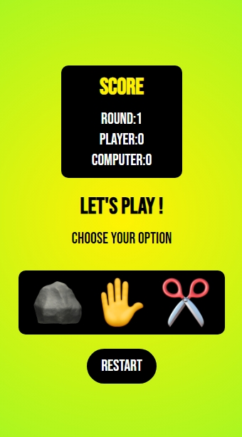

# :rock::page_with_curl::scissors:

## Description
This is a classic Rock, Paper, Scissors game developed with HTML, CSS, and JavaScript. The goal is to play against the computer and see who wins more rounds out of a total of 5. The game allows the user to choose between rock, paper, or scissors and compares their choice with the computer's to determine the winner of each round and the overall winner.

## Features
- Interactive web game.
- Choice between rock, paper, and scissors.
- Real-time score updates.
- Round-by-round and final result messages.
- Option to restart the game.

## Screenshots

## Technologies

